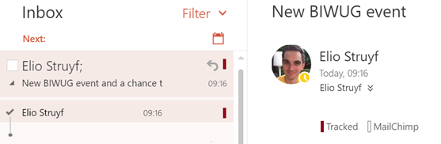
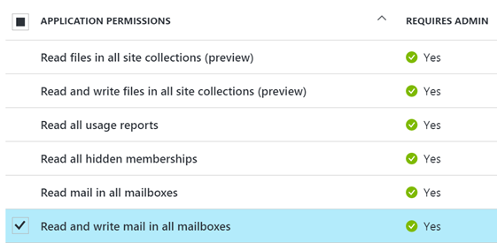
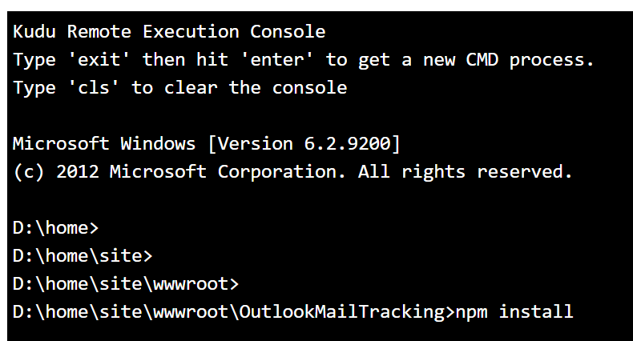

# Mail tracker Azure Function

Azure Function which can be used to check if your mails are tracked by making use of the Microsoft Graph webhook functionality. Every time you receive an email, it will be passed to the Azure Function which checks the mail contents. If the mail contains a tracker, it will get the tracked category and also which tracker it found:



> **Important**: currenlty this function code is created for single person use. If you want to run it for your whole application, you will have to do some code changes.

## Adding trackers

All you need to do for adding new trackers is add them in the `trackers.json` file:

```json
{
    "name": "Tracker",
    "url": "part of the URL to check"
}
```

> **Note**: If you have suggestions or other trackers, please create an issue.

## Installation

If you want to make use of this Azure Function code, you will have to go through the following steps:

### Azure AD Application
1. Create a new Azure AD application
    - Name: Email Tracker
    - URL: https://localhost:3000
1. Copy the **Application ID** and paste it into the `config.json` file (**clientID**).
1. In the Azure AD app, click **keys** and generate a new secret key. Once generated copy it, and paste it in the `config.json` file (**clientSecret**).
1. Go to the permissions section of the Azure AD app, and add **Microsoft Graph** API and give the app **Mail.ReadWrite** permissions.


### Azure Function
1. Create a new JavaScript HTTP Triggered function, change the type to **anonymous** function.
1. Copy the URL of the function and add it to the `config.json` file (**notificationUrl**).

### Remaining configuration
You will notice that you still have three properties which are required to fill in:
- subscriptionId
- user id (in the resource)
- clientState

**subscriptionId**

I choose to manually insert the ID after the subscription got created. As this is only running for one user, it only should maintain one subscription. If you want to support multiple, a better approach would be to use a database behind the scenes.

> Best to first upload the code, create a new subscription and fill in this property.

**User id**

Specify the ID of the user or its UPN.

**ClientState**

You can choose what you want to fill in. This is an identifier for your webhook subscription. I choose to use: EmailTrackerFunction.

### Uploading the code

Once all the configuration is done, upload the code to your Azure Function. 

> **Important**: When you deployed the code via continuous deployment, you do not have to execute the next step.

Once uploaded, open **Kudu** from the function app settings page. Navigate to the function folder, and execute `npm install`. Which will install all the required packages.



## Creating, updating, deleting

### Creating

Once everything is in place, you can create your new webhook subscription.

1. Go to: `https://function-url?action=create`
1. Once you got a response, go to your function in the Azure portal and click on **monitor**.
1. In the logs, you should now see two new request. Copy the subscription ID from the log output and paste it in the `config.json` file.

> **Note**: you can also create your webhook subscription via the [Microsoft Graph Explorer](https://developer.microsoft.com/en-us/graph/graph-explorer).

### Updating

If you want to update the subscription, you should call the following URL: `https://function-url?action=update`

> **Info**: in order to not let my subscription expire. I created a Timer triggered function which calls this endpoint every night.

### Deleting

If you want to delete the subscription, you should call the following URL: `https://function-url?action=delete`